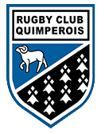
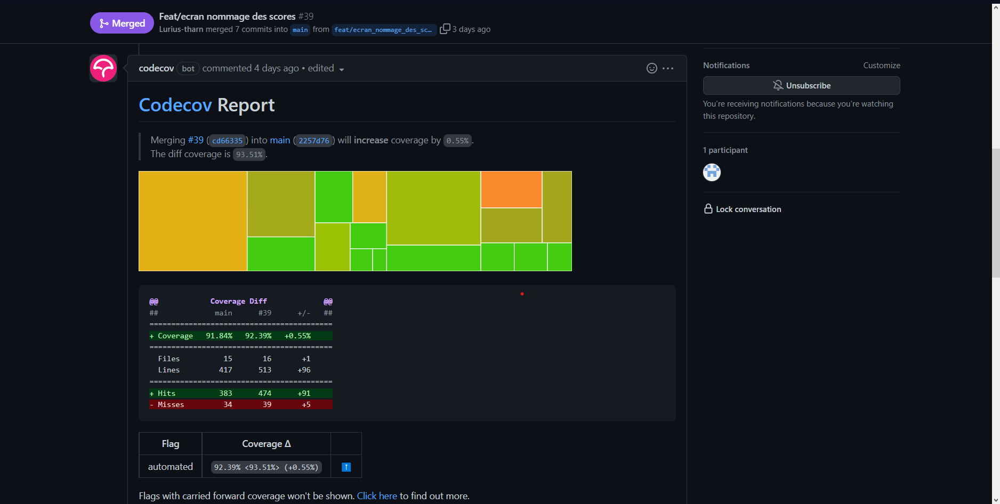
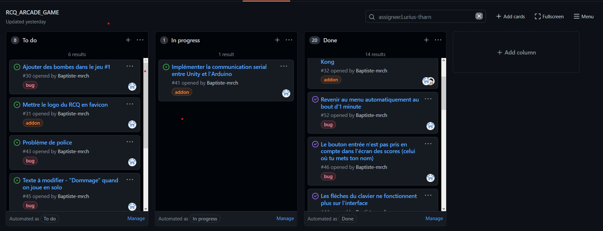

 [![Contributors][contributors-shield]][contributors-url]
[![Forks][forks-shield]][forks-url]
[![Stargazers][stars-shield]][stars-url]
[![Issues][issues-shield]][issues-url]

 

## RCQ GAME
<p></p>


RCQ GAME est un jeu vidéo développé par quatre étudiants, dans le cadre d'un projet de fin de licence au sein de l'école d'informatique ESIEE-IT.

* **RCQ GAME** est un jeu s'inspirant du style rétro des **jeux d'arcades** .
* Ce projet est réalisé pour le  **RCQ**, le **Rugby Club Quimpérois**, 
  et il a pour but d'inaugurer leur nouvelle salle de jeu avec une borne d'arcade.


<p align="center">
  
</p>

### Installation du projet sur son disque local
Pour installer le code source du jeu, utiliser cette commande dans un git Bash (Git requis sur votre machine)
   ```sh
   git clone https://github.com/rcq-arcade-esiee-it/RCQ_Arcade
   ```
Ou vous pouvez le télécharger directement en cliquant sur le bouton vert Code, puis Download ZIP

Une fois le projet téléchargé, assurez vous d'avoir la bonne version du logiciel Unity 
  ```sh
2021.3.0f1   
```

### Arborescence et dossiers principaux du projet Unity

<p>.github :  contient l'ensemble des fichiers liés à github ( images du readme, actions...)</p>

<p> Assets :  contient l'ensemble des fichiers liés au projet Unity ( sprites, animations, scripts, controleurs)</p>

### Couverture de code et déploiement

Nous avons mis en place plusieurs actions permettant à un développeur qui crée une pull request, de vérifié la couverture de code de ses fonctionnalités, ainsi qu'un script de déploiement, permettant de générer le projet en fichier exécutable. (Linux ou Windows)
<p align="center">

</p>


### Développement d'une fonctionnalité, correction d'un bug, ajout d'un enabler

Nous avons structuré nos branches afin de distinguer le travail d'un développeur :
<ul>
    <li>Une branche commencant par "feat/" , ajoute une nouvelle fonctioonnalité
</li>
<li>Une branche commencant par "fix/" , corrige une anomalie décélé par notre testeur
</li>
<li>Une branche commencant par "addon/" , implémente un élément en plus qui n'a pas été pensé lors de la rédaction d'une fonctionnalité
</li>
<li>Une branche commencant par "chore/" , permet de faire un déploiement
</li>
</ul>

### Suivi d'anomalie, gestion des tickets

Nous avons mis en place un project github afin d'avoir un meilleur suivi de notre progression :

<p align="center">

</p>


